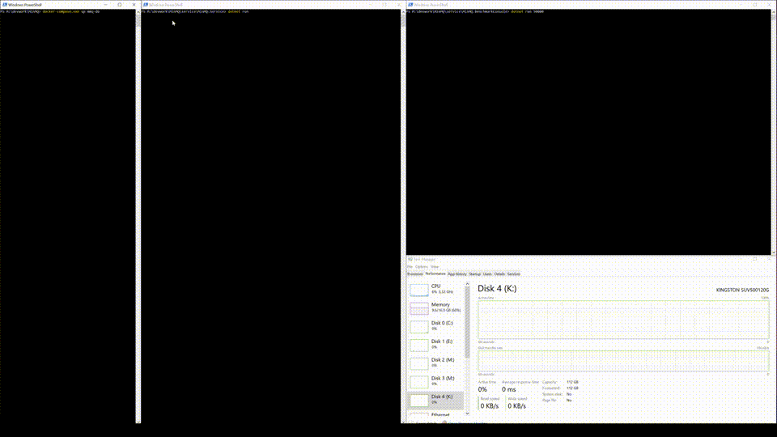

# MinMQ

**Note:** _This is work-in-progress. So far only prototype API is in place for write queries. Nothing exists in terms of
a managed or defined API for sending or retrieving messages. At the moment messages are being flushed to Postgres 
for review and follow-up purposes; Making sure sent messages eventually show up._  

MinMQ is a minimal message queue for private networks, on-premise, or non-public networks. Atleast not for the time
being. It targets virtual machines, Docker and physical hosts. It's designed for low ceremony, high throughput,
medium-to-low latency, and has a HTTP-transport for comfortable transmission of messages.

## This effort focuses on:
- Low latency
- High throughput (storage dependant)
- Durable, transactional commits
- Continuous benchmarking
- In-order processing

This implementation merely combines the efforts of [microsoft.FASTER](https://github.com/microsoft/FASTER) and 
[AspNet Core 3.0](https://docs.microsoft.com/en-us/aspnet/core/?view=aspnetcore-3.0). A HTTP-transports on top of a *very*
fast recoverable log. FASTER provides "group commits" with [Concurrent Prefix Recovery](https://www.microsoft.com/en-us/research/uploads/prod/2019/01/cpr-sigmod19.pdf) rather than a [Work Ahead Log](https://wiki.postgresql.org/wiki/Improve_the_performance_of_ALTER_TABLE_SET_LOGGED_UNLOGGED_statement). This approach is reminiscent to that of [Microsoft Message Queue](https://support.microsoft.com/ms-my/help/256096/how-to-install-msmq-2-0-to-enable-queued-components) for
messages transacted in bulk using Microsoft Distributed Transaction Coordinator. Albeit, this a quite different approach
from "unlogged" tables or in-memory databases flushing to a durable disk later on which doesn't provide the same level
of durability.

## Soon, the following things will be explored
- A formal API (perhaps something reminiscent to MSMQ or IronMQ)
  - `Send` (or Post)
  - Explicit two-phase commits for retrieving messages:
    - `Peek` (or Reserve)
    - `Delete` (or Recieve or Get)  
- A Docker image and/or [Helm charts](https://helm.sh/).
- Error-queues.
- Named queues.
- Mime-Types.
- Message content limit (<1 MB).
- Flushing to multiple IDevices. Currently, all records are flushing to Postgres. 

## In a more distant future the following things may also be explored:
- Read models: Faster KV, SQL Materalized views or cached responses.
- Some kind of tiered solution:
  - Log splicing, it's most likely that dealing with errors or unread message will require logs to be entirely rewritten
  possibly even [compacted](http://cloudurable.com/blog/kafka-architecture-log-compaction/index.html). Log compaction
  may already have been added by the [FASTER-team](https://microsoft.github.io/FASTER/roadmap). _Investigate this._
  - [N-tiered service provisioning](docs/ntiered.md)
  - Multiple IDevices and a commit-schedular with knowledge of logical devices (however, how to saturate a SSD over HTTP
  is beyond me).
  - Inbound FlatBuffers or Protobuf from a single or multiple HTTP-hosts.
- Swagger/Swashbuckle
- More [advanced benchmarks suites](https://github.com/aspnet/Benchmarks).
- Possibly a client, or and example implementation of set of atomic yet composite messages.
- Authentication
- Dynamic latency-scaling.

## Setup
### Setup a volume or disk area for FASTER IDevice
FASTER allocates disk preemptively. Around 1.1 GB is used per default. Consequently a large docker volume, or path on
disk that comfortably can allocate more than 1.1GB have to be assigned, preferably an SSD. For the time beeing only
local IDevices can be configured. 

*Docker users*
> Inspect the `setup.ps1` and change path so corresponds some disk space. For comfort i may be simpler change it to
> shell-script instead. Docker-compose volume is defined with `external: true` so a disk _won't be_ created automatically.

*Everyone else*
> If you plan to run the service without a container service a FasterDevice-path must be set as in
> [appsettings.Development.json](./service/MinMQ.Service/appsettings.Development.json). It
> must be assigned before starting.

### How to debug with Visual Studio

1. Open a terminal and navigate to repository root `git rev-parse --show-toplevel` or so.
2. Type `docker-compose up mmq-db` which starts the reporting Postgres-database meant for analysis of the results
3. Open Visual studio and set _MinMQ.Service_ as the start-up project
4. Run the solution
5. Open a second terminal and navigate to service/MinMQ.BenchmarkConsole
6. Type `dotnet run 5000` to send 5000 XMLs and 5000 JSONs to the service

### How to run on Debian Buster - armhf

1. Open a terminal and type `sudo docker-compose build`
2. And then `sudo docker-compose up mmq-db mmq-service-express mmq-service mmq-service-hapi mmq-service-nodejs`
3. TBD on how to run service/MinMQ.BenchmarkConsole
4. A the moment, you can run `sudo docker-compose run mmq-benchmarks -- post_message.sh` in a separate terminal which
    launches a armhf-patched version wg/wrk built in step 1.

## Performance
This is continiously measured and some sparse unstructed working documenets are available in [docs/perf.md](docs/perf.md). More information on how to continue the development work can be found [here](docs/development_work.md). But overall the with the custom made benchmarker about 30-50% saturation of a SATA SSD seems to be plausible. 

## Further reading

- [FASTER: An Embedded Key-Value Store for State Management (video)](https://www.microsoft.com/en-us/research/video/faster-an-embedded-key-value-store-for-state-management/)
- [FASTERs Github repository](https://github.com/microsoft/FASTER)
- [https://aka.ms/FASTER](https://aka.ms/FASTER)

## TL;DR
Here are some useful commands. _Create a new queue._

    curl -X PUT -d "" http://localhost:9000/queue/merde --trace-asci /dev/stdout

Clear out the database and starting it again:

    docker-compose.exe down
    docker volume rm minmq_postgresdata
    docker-compose.exe up mmq-db

Then open Visual Studio Pro/Community and PMC: 

    update-database -context messagequeuecontext

