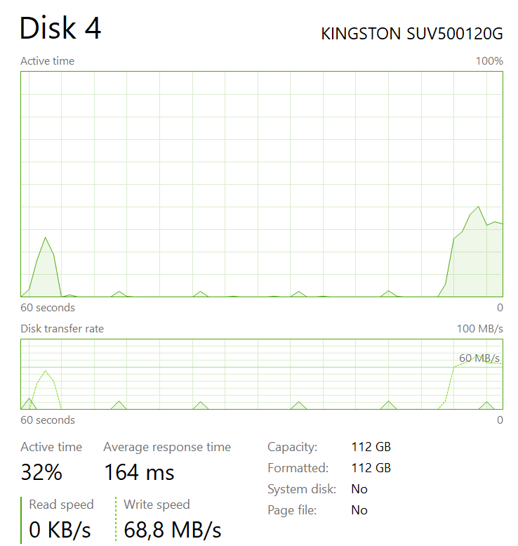

# MinMQ

**Note:** _This is work-in-progress. A prototype API is in place to write queries. Nothing exists
in terms of formal API for sending or retrieving messages. At the moment messages are being flushed
to Postgres for review and follow-up purposes; Making sure sent messages eventually show up._  

MinMQ is a minimal message queue for private networks, on-premise, or non-public networks for the
time being. It targets virtual machines, Docker and physical hosts. It's designed for low ceremony,
high throughput, medium-to-low latency, and has a HTTP-transport for comfortable transmission of
messages.

## This effort focuses on:
- Low latency
- High throughput (storage dependant)
- Durable, transactional commits
- In-order processing
- Continuous benchmarking

This implementation merely combines the efforts of [microsoft.FASTER](https://github.com/microsoft/FASTER) and 
[AspNet Core 3.0](https://docs.microsoft.com/en-us/aspnet/core/?view=aspnetcore-3.0). A HTTP-transports on top of a *very*
fast log. FASTER provides "group commits" with [Concurrent Prefix Recovery](https://www.microsoft.com/en-us/research/uploads/prod/2019/01/cpr-sigmod19.pdf) rather than a [Work Ahead Log](https://wiki.postgresql.org/wiki/Improve_the_performance_of_ALTER_TABLE_SET_LOGGED_UNLOGGED_statement). This approach is reminiscent to that of [Microsoft Message Queue](https://support.microsoft.com/ms-my/help/256096/how-to-install-msmq-2-0-to-enable-queued-components) for
messages transacted in bulk using Microsoft Distributed Transaction Coordinator. Albeit, this is quite diffent from "unlogged" tables or in-memory database 
flushing to a durable disk later on. 

## Eventually the following things will be explored
- A formal API (perhaps something reminiscent to MSMQ or IronMQ)
  - `Send` (or Post)
  - `Peek` (or Reserve)
  - `Delete` (or Recieve or Get)
- Implementation per specification pattern for bootstrapping onto Kestrel.
  - Named queues.
  - Mime-Types (probably pre-defined).
  - Deleting queues.
  - Message content limit (<1 MB).
  - Should there be Error-queues?
- Make a C# client:
  - Separate project (or solution and/or repository).
  - Wraps https requests effectively. 
  - Extend with Reactive Extensions
  - What to do about bulk operations e.g. on-the-fly log compaction via delegate or interface and the specification pattern.

## In a more distant future the following things may also be explored:
- A queue management tools, that supports mime types and named queues and a formal token based security API for admin provisioning.
_Only allow for empty queues to be deleted?_
- Read models: Faster KV, SQL Materalized views or cached responses.
- Some kind of tiered solution:
  - Log splicing (it's likely that dealing with errors or unread message will require logs to be entirely rewritten
  possibly even [compacted](http://cloudurable.com/blog/kafka-architecture-log-compaction/index.html). 
  - Internal relaying [N-tiered service provisioning](docs/ntiered.md).
  - Multiple IDevices and a commit-schedular settings.
- Admin tool authentication and queue privilages (w/r/d)

## Unresolved talking points
- Should the constant commit interval cater for high contension scenario only or dynamically change depending on the load.
- How to manage storage or IDevice overflow?
- Is there a point to adding an API for inbound FlatBuffers or Protobuf since this project is closely related to Kestrel.
- Is there point to creating a Docker image and/or [Helm charts](https://helm.sh/) as a stand-alone Kestrel+MinMQ-host?
- Should [advanced benchmarks suites](https://github.com/aspnet/Benchmarks) per AspNetCore's recommendation be used?
- Should non-empty queues allow for deletion? 

## Setup
### Setup a volume or disk area for FASTER IDevice
FASTER allocates disk preemptively. Around 1.1 GB is used per default. Consequently a large docker volume, or path on
disk that comfortably can allocate more than 1.1GB have to be assigned, preferably an SSD. For the time beeing only
local IDevices can be configured. 

*Docker users*
> Inspect the `setup.ps1` and change path so corresponds some disk space. For comfort i may be simpler change it to
> shell-script instead. Docker-compose volume is defined with `external: true` so a disk _won't be_ created automatically.

*Everyone else*
> If you plan to run the service without a container service a FasterDevice-path must be set as in
> [appsettings.Development.json](./service/MinMQ.Service/appsettings.Development.json). It
> must be assigned before starting.

## Performance
This is continiously measured and some sparse unstructed working documenets are available in [docs/perf.md](docs/perf.md).

More information on how to continue the development work can be found [here](docs/development_work.md). 

But overall the with the custom made benchmarker about 30-50% saturation of a SATA SSD seems to be plausible. 

## TL;DR
Here are some useful commands. _Create a new queue._

    curl -X PUT -d "" http://localhost:9000/queue/merde --trace-asci /dev/stdout

Clear out the database and starting it again:

    docker-compose.exe down
    docker volume rm minmq_postgresdata
    docker-compose.exe up mmq-db

Then open Visual Studio Pro/Community and PMC: 

    update-database -context messagequeuecontext

