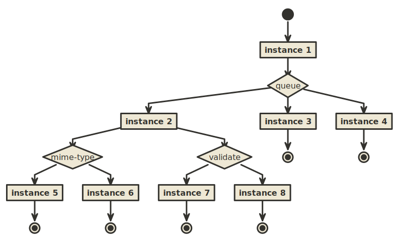

## N-tiered queue provisioning
_Note: Work in progress._

This serves as an outline for a distributed approach of the FASTER Log rather than a KV-store in the end. It requires message metadata to be included prepended to the written log message.

